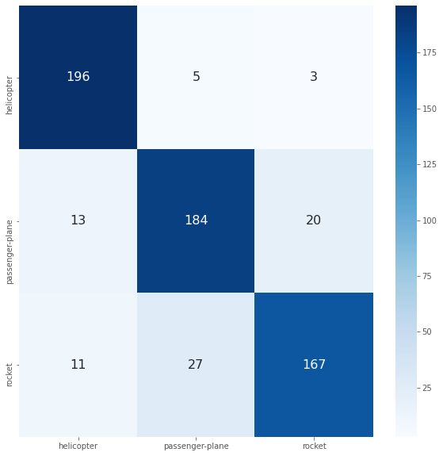

# Flight Classification
Deep learning model to classify flight images.

## Dataset

I have prepared following three kind of images. Here is the dataset [link](https://drive.google.com/drive/folders/1nxuB7sUnUIaj8keUQfPeEy-HCUqziwUR?usp=sharing)

* helicopter
* passenger-plane
* rocket

## Deep learning model

I am using pre-trained [ResNet50](https://github.com/fchollet/deep-learning-models/blob/master/resnet50.py) model to train model with above dataset. I have fine tuned the model to work with custom dataset.

## How to check model accuracy

You can checkout **Flight Prediction.ipynb** Colab Notebook to see the image prediction results.

## Model Performance(Confusion Matrix)

